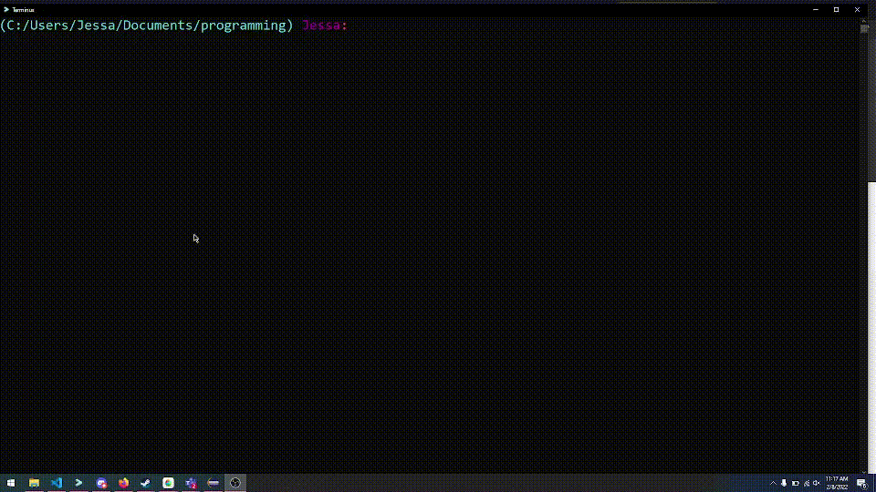
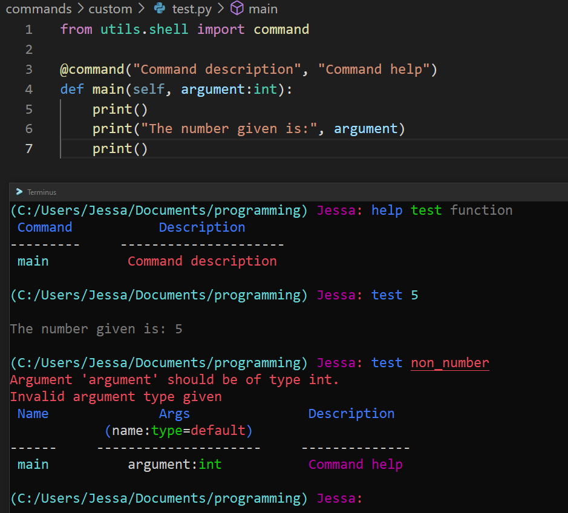

# Custom shell

This custom shell is a python alternative for your standard windows cmd.
It has custom modules, easy usage and easily customizable.

Join the **[discord](https://discord.gg/ZWFefjGf2g)** server to get help, download modules or upload your own!

## Functions

- Easy customization
- Easily add custom commands
- Command highlighting
- Command suggestions
- Tab complete
- Automatic argument type parser

## Examples

This gif shows the command highlighting, command suggestion, and tab complete

This image shows the code of a custom command.
As you can see, it also automatically parses if the argument is an int or not!

## Why use it

This shell is made with customization and functionality in mind.
It allows you to add new commands, change the look of your shell and a lot more within seconds!

### Why i made it

I made this because i personally really didn't like the default windows command prompt.
So i decided i'd make my own shell that'll be more customizable AND look better.
This is my third time making a shell, and with that also the best version. 

## TODO

- Fix and add more documentation
- Fix color bug when typing in a backslash
- Find more bugs so i can fix them
- Add GIT auto update-detector
- Add highlighting and suggestion when a new command is added using `modules refresh`